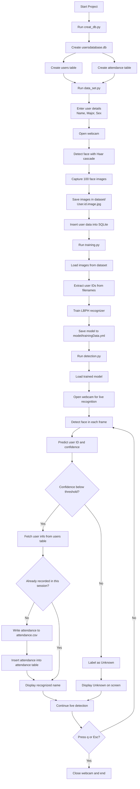

# AI-Based Face Recognition Attendance for Smart Classrooms

This project is a desktop-based face recognition attendance system built with OpenCV, SQLite, and CSV logging. It allows you to register users with a webcam, train a face recognition model from the captured images, and then run real-time face recognition to mark attendance automatically.

The system is organized as a simple pipeline:

1. Create the database.
2. Register users and capture face images.
3. Train the recognition model.
4. Run live face recognition and attendance logging.

## Project Goals

The project is designed to support classroom or lab attendance scenarios where:

- students or users are enrolled with their face data,
- facial images are stored locally for training,
- recognition runs in real time through a webcam,
- attendance is recorded automatically when a known face appears.

It is intentionally lightweight and local-first. There is no web server, cloud dependency, or external database requirement.

## Main Features

- Face registration using a webcam
- Automatic storage of user metadata in SQLite
- Automatic capture of 100 grayscale face images per user
- Face recognition model training using OpenCV LBPH recognizer
- Real-time recognition from webcam feed
- Attendance logging to both CSV and SQLite
- Duplicate prevention during a single recognition session
- On-screen recognition labels and confidence percentage
- Adjustable recognition threshold through an OpenCV trackbar

## Tech Stack

- Python
- OpenCV
- opencv-contrib-python
- NumPy
- Pillow
- SQLite
- CSV file logging

## How the System Works

### 1. Database Initialization

The script `creat_db.py` creates the local SQLite database file `usersdatabase.db` and ensures that the required tables exist:

- `users`: stores registered user information
- `attendance`: stores timestamped attendance entries

This script is safe to run multiple times because it uses `CREATE TABLE IF NOT EXISTS`.

### 2. User Enrollment

The script `data_set.py`:

- asks for the user's name,
- asks for the user's major,
- asks for the user's sex (`M` or `F`),
- opens the webcam,
- detects faces using Haar cascade,
- inserts the user into the `users` table,
- captures and saves 100 detected face images in the `dataset/` folder.

Captured image files follow this naming pattern:

```text
User.<id>.<image_number>.jpg
```

Example:

```text
User.5.27.jpg
```

This means:

- `5` is the database user ID
- `27` is the 27th captured image for that user

### 3. Model Training

The script `training.py` scans the `dataset/` directory, loads all valid `.jpg` images, extracts the user ID from each filename, and trains an LBPH face recognizer.

The trained model is saved to:

```text
model/trainingData.yml
```

If there are no valid images in the dataset, training will stop with an error.

### 4. Real-Time Recognition and Attendance

The script `detection.py`:

- loads the trained LBPH model,
- opens the webcam,
- detects faces in each frame,
- predicts the user ID of each detected face,
- checks whether the confidence score passes the configured threshold,
- looks up the user in the `users` table,
- logs attendance into `attendance.csv`,
- logs attendance into the `attendance` database table,
- prevents logging the same user more than once during the current session.

The recognition window also shows:

- user name for recognized faces,
- `Unknown` for unmatched faces,
- `Unregistered` if the face ID exists in the model but is not found in the database,
- confidence percentage on screen,
- current time,
- count of recognized users recorded in the current session.

Press `q` or `Esc` to exit the recognition window.

## Project Structure

```text
face_detection_open_cv/
|-- attendance.csv
|-- creat_db.py
|-- data_set.py
|-- detection.py
|-- haarcascade_eye_tree_eyeglasses.xml
|-- haarcascade_frontalface_default.xml
|-- README.md
|-- requirements.txt
|-- training.py
|-- dataset/
|-- model/
|   |-- trainingData.yml
|-- open_cv/
```

## File Descriptions

### `creat_db.py`

Initializes the SQLite database and creates the required tables.

Tables created:

- `users`
- `attendance`

### `data_set.py`

Handles user registration and captures face images from the webcam.

Responsibilities:

- collect user details,
- insert user data into the database,
- detect a face in webcam frames,
- save 100 grayscale face crops into `dataset/`.

### `training.py`

Builds the face recognition model from saved images.

Responsibilities:

- read images from `dataset/`,
- parse user IDs from filenames,
- train the LBPH recognizer,
- save the trained model into `model/trainingData.yml`.

### `detection.py`

Performs live face recognition and attendance marking.

Responsibilities:

- load the trained model,
- open the webcam,
- detect faces in real time,
- recognize registered users,
- log attendance to CSV and database,
- avoid duplicate attendance entries in the same run.

## Database Schema

The SQLite database file is created as:

```text
usersdatabase.db
```

### `users` table

| Column | Type | Description |
|---|---|---|
| `id` | INTEGER | Primary key, auto-incremented user ID |
| `name` | TEXT | User name |
| `major` | TEXT | User major or department |
| `sex` | TEXT | `M` or `F` |
| `reg_time` | TEXT | Registration timestamp |

### `attendance` table

| Column | Type | Description |
|---|---|---|
| `id` | INTEGER | Primary key |
| `user_id` | INTEGER | Foreign key referencing `users.id` |
| `timestamp` | TEXT | Attendance timestamp |

## Attendance CSV Format

If `attendance.csv` does not exist, it is created automatically with this header:

```csv
User ID,Name,Major,Sex,Datetime
```

Each recognized user is appended as one row when first seen during the current detection session.

## Requirements

The project dependencies are listed in `requirements.txt`:

```text
opencv-contrib-python>=4.10.0
numpy>=1.26.0
pillow>=10.0.0
```

## Prerequisites

Before running the project, make sure you have:

- Python 3.10 or newer recommended
- A working webcam
- Windows, Linux, or macOS with GUI support for OpenCV windows
- Permission for Python to access the camera

Important note:

- `opencv-contrib-python` is required because the project uses `cv2.face.LBPHFaceRecognizer_create()`.
- If you install plain `opencv-python` only, the LBPH recognizer will not be available.

## Installation

### Windows PowerShell

```powershell
python -m venv .venv
.venv\Scripts\Activate
pip install -r requirements.txt
```

### Generic Python Setup

```bash
python -m venv .venv
source .venv/bin/activate
pip install -r requirements.txt
```

## Recommended Usage Order

Run the scripts in this order:

```text
1. python creat_db.py
2. python data_set.py
3. python training.py
4. python detection.py
```

If you add new users later, run `training.py` again before using `detection.py`.

## Step-by-Step Usage

### Step 1: Initialize the Database

```bash
python creat_db.py
```

Expected result:

- `usersdatabase.db` is created if it does not exist.
- `users` and `attendance` tables are created if missing.

### Step 2: Register a User

```bash
python data_set.py
```

You will be prompted for:

- name,
- major,
- sex.

Then the webcam opens and face images are captured.

Controls:

- let the script continue until it captures 100 images,
- press `q` to stop early,
- press `Esc` to stop early.

Tips for better training data:

- look directly at the camera,
- keep your face well lit,
- avoid strong shadows,
- vary your expression slightly,
- keep the background simple when possible.

### Step 3: Train the Face Recognition Model

```bash
python training.py
```

Expected result:

- images from `dataset/` are read,
- IDs are extracted from filenames,
- the LBPH model is trained,
- `model/trainingData.yml` is created or overwritten.

### Step 4: Run Real-Time Face Recognition

```bash
python detection.py
```

Expected behavior:

- webcam feed opens,
- detected faces are outlined,
- recognized users show their names,
- unknown users show `Unknown`,
- attendance is saved to `attendance.csv`,
- attendance is also inserted into the SQLite `attendance` table.

Controls:

- press `q` to quit,
- press `Esc` to quit.

## Flow Chart

The following Mermaid flow chart shows the complete project workflow from setup to attendance logging:



## Recognition Threshold

In `detection.py`, the default threshold is:

```python
DEFAULT_CONFIDENCE_THRESHOLD = 65
```

Lower LBPH confidence values indicate better matches in this project.

This means:

- lower threshold = stricter recognition,
- higher threshold = looser recognition.

When `USE_TRACKBAR = True`, a trackbar appears in the recognition window so you can adjust the threshold at runtime.

## Data Flow Summary

The project uses this data flow:

```text
Webcam -> Face Detection -> Dataset Images -> Model Training -> Live Recognition -> Attendance Logs
```

More specifically:

```text
User webcam capture
-> face detected with Haar cascade
-> cropped grayscale images saved in dataset/
-> training.py reads dataset/
-> LBPH model saved to model/trainingData.yml
-> detection.py loads model and database
-> recognized face matched with user metadata
-> attendance written to CSV and SQLite
```

## Current Design Decisions

This project currently uses:

- Haar cascade for face detection
- LBPH for face recognition
- local SQLite database for metadata and attendance
- local CSV file for simple exportable attendance records

Why this design is practical:

- easy to run offline,
- no internet dependency,
- simple enough for academic projects and prototypes,
- SQLite and CSV are easy to inspect and debug.

## Limitations

This implementation is useful for learning and small-scale demos, but it has a few practical limitations:

- Haar cascades are sensitive to lighting and angle changes.
- Recognition quality depends heavily on enrollment image quality.
- Duplicate prevention is session-based only, not day-based.
- The scripts are standalone and not packaged as a single application.
- There is no admin dashboard or reporting UI.
- The model should be retrained whenever new users are added.
- Attendance is stored locally only.

## Troubleshooting

### `cv2.face` or `LBPHFaceRecognizer_create` is missing

Cause:

- `opencv-contrib-python` is not installed.

Fix:

```bash
pip install opencv-contrib-python
```

### Webcam cannot open

Cause:

- camera is disconnected,
- camera is already in use by another application,
- camera permissions are blocked.

Fix:

- close other camera apps,
- reconnect the webcam,
- check OS camera permissions.

### `Please train the data first`

Cause:

- `model/trainingData.yml` does not exist yet.

Fix:

```bash
python training.py
```

### Training fails with no images found

Cause:

- the `dataset/` folder is empty,
- enrollment was not completed,
- filenames do not match the expected pattern.

Fix:

- run `data_set.py` first,
- make sure images are saved as `User.<id>.<num>.jpg`.

### Recognition accuracy is low

Cause:

- poor lighting,
- blurry captures,
- limited variety in training images,
- threshold not tuned well.

Fix:

- capture clearer training images,
- improve lighting,
- retrain after adding better images,
- adjust the confidence threshold.

### OpenCV window does not display correctly

Cause:

- running in a headless environment or unsupported remote session.

Fix:

- run the project on a local machine with GUI support.

## Possible Improvements

If you want to extend the project, these are good next steps:

- add per-day duplicate suppression for attendance
- export attendance by date or user
- add a GUI for registration and recognition
- store face embeddings instead of only LBPH model data
- add model evaluation metrics
- use a stronger detector such as DNN or MediaPipe
- add face alignment before recognition
- package the system as a complete desktop app

## Example Workflow

```bash
python creat_db.py
python data_set.py
python training.py
python detection.py
```

## Notes About Naming

The script name `creat_db.py` is kept as-is in this project. If you rename it later to `create_db.py`, make sure the documentation and workflow commands are updated as well.

## License

This project is licensed under the MIT License.

See the `LICENSE` file for the full text.

## Acknowledgements

- OpenCV for computer vision tools
- SQLite for lightweight local data storage
- Pillow for image handling during training
